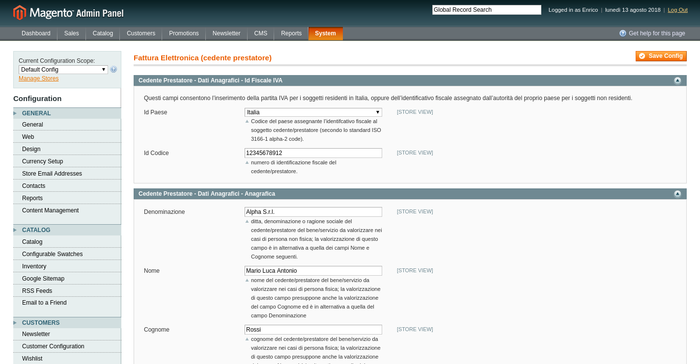
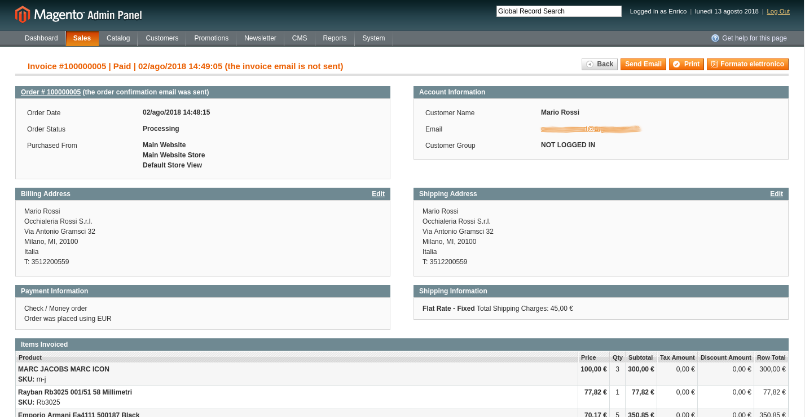
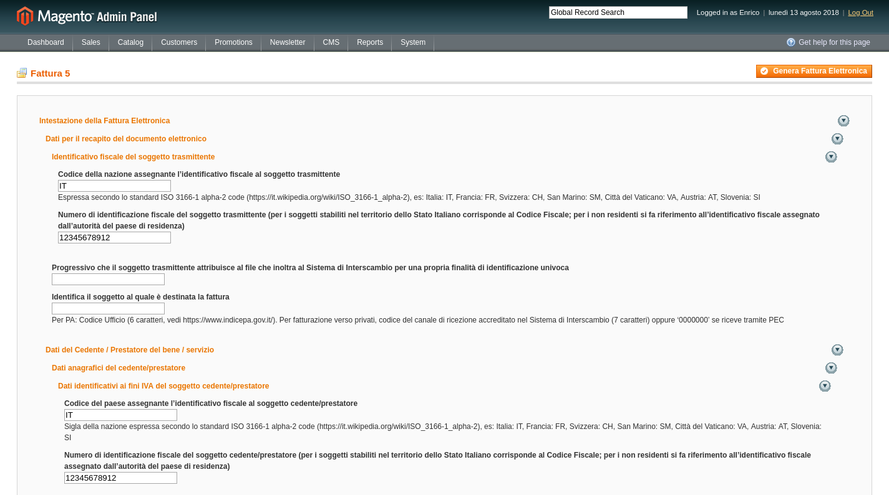

# fatturapa-magento

Plugin Magento 1.9.x per fatturazione elettronica

Funzionalità:
- configurazione dei campi comuni ad ogni fattura per il cedente / prestatore
- generazione di una bozza di fattura elettronica a partire dalla fattura Magento
- dopo il completamento dei campi mancanti, permette di scaricare il file fattura nel formato XML.

Le fatture elettroniche tra privati vengono trasmesse ed archiviate in formato XML, in accordo con le specifiche disponibili al seguente url: http://www.fatturapa.gov.it/export/fatturazione/it/normativa/f-2.htm

## Getting Started

Testato con Magento 1.9.3.9 su Debian 9.4 (stretch) amd64 con PHP 5.6.37.

### Installazione

Generare il file ZIP con i files da installare lanciando all'interno del repository il comando:
```
./make dist
```

Copiare il file ZIP generato ed estrarlo nella cartella di installazione di Magento sul tuo hosting

All'interno dell'interfaccia utente amministrativa Magento, vai su `System -> Cache management` (italiano: `Sistema -> Gestione della Cache`) e clicca su `Flush Magento Cache` e `Flush Cache Storage` in alto a destra.

### Configurazione

All'interno dell'interfaccia utente amministrativa di Magento, vai su `System -> Configuration` (italiano: `Sistema -> Configurazione`), quindi `Sales` (italiano: `Vendite`) e infine `Fattura Elettronica (cedente prestatore)`; qui puoi Configurare i campi comuni ad ogni fattura per il cedente / prestatore:



### Utilizzo

Genera la fattura Magento normalmente.

Nell'interfaccia amministrativa di Magento, vai a `Sales -> Invoices` (italiano: `Vendite -> Fatture`), seleziona un ordine per visualizzare la fattura Magento:



quindi clicca su `Formato elettronico` in alto a destra per visualizzare la bozza di fattura elettronica:



Modifica la bozza aggiungendo le informazioni mancanti:
1. Progressivo che il soggetto trasmittente attribuisce al file che inoltra al Sistema di Interscambio per una propria finalità di identificazione univoca
2. Codice identificativo del soggetto al quale è destinata la fattura (codice del canale di ricezione accreditato nel Sistema di Interscambio (7 caratteri) oppure ‘0000000’ se il destinatario riceve tramite PEC)
3. Numero progressivo attribuito dal cedente/prestatore al documento

Infine clicca sul bottone `Genera fattura elettronica` in alto a destra per scaricare la fattura XML.

## Autori

Enrico Gennari, Riccardo Mariani e Paolo Greppi, simevo s.r.l.

## License

Copyright (c) 2018, simevo s.r.l.

License: AGPL 3, see [LICENSE](LICENSE) file.
